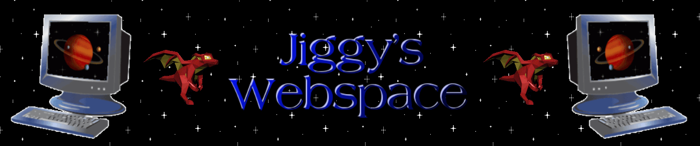

<h1>Jiggy's Webspace</h1>

My personal website designed in an old y2k style where you can find out information about my interests as well as things I like. Built with TailwindCSS, <a href="https://github.com/jdan/98.css">98.css</a> and vanilla JS.

[Jiggy's Webspace](https://nicoll-douglas.github.io)

<h2>Installation</h2>
If you wish to install and run this project locally:

1. `git clone git@github.com:nicoll-douglas/nicoll-douglas.git`

2. <code>cd nicoll-douglas</code>

3. <code>npm install</code>

4. <code>npm run dev</code>

<h2>Features</h2>
<ul>
  <li>Quirky and aesthetic design</li>
  <li>Responsive design & web accessible</li>
  <li>Easy site navigation</li>
</ul>
